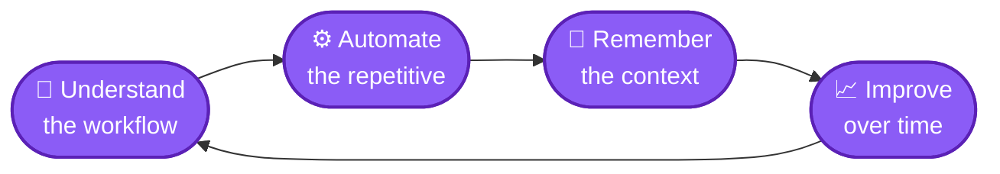
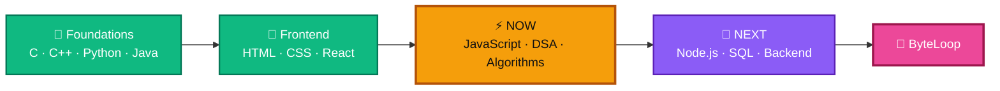

<div align="center">


<br/>

<a href="https://aryan-portfolio-eight.vercel.app/"></a>
<a href="https://github.com/aryan-devv"></a>
<a href="https://www.linkedin.com/in/aryan-devv"></a>
<a href="https://leetcode.com/u/aryan-devv/"></a>
<a href="mailto:yadavaryan.jp@gmail.com"></a>

<br/><br/>


<br/><br/>

<b>
<a href="#whoami">About</a> &nbsp;·&nbsp;
<a href="#stack">Stack</a> &nbsp;·&nbsp;
<a href="#work">Work</a> &nbsp;·&nbsp;
<a href="#solve">Solve</a> &nbsp;·&nbsp;
<a href="#github">GitHub</a> &nbsp;·&nbsp;
<a href="#roadmap">Roadmap</a> &nbsp;·&nbsp;
<a href="#connect">Connect</a>
</b>

</div>

<br/>


<br/>

<!-- ───────────────────────── WHOAMI ───────────────────────── -->

<a name="whoami"></a>
<div align="center">

<br/>
<i>who's behind the keyboard</i>
</div>

<br/>

<table>
<tr>

<td width="58%" valign="top">

**Hey, I'm Aryan 👋** A Software Engineering student from Mumbai who learns by building.

I take an idea, figure out what I don't know, learn the pieces I need, and turn it into something that actually runs. (Sometimes on the first try. Sometimes.)

```ts
const aryan = {
  role:       "Software Engineering Student",
  base:       "Mumbai, India",
  learned:    ["C", "C++", "Python", "Java", "HTML", "CSS", "React"],
  learning:   ["JavaScript", "DSA", "Algorithms", "Node.js", "SQL"],
  building:   "ByteLoop",
  philosophy: "Understand before copying.",
  status:     "compiling... 0 errors, 3 warnings",
};
```

</td>

<td width="42%" valign="top">

### ⚡ Right now

🔭 **Learning** · JavaScript, DSA, Algorithms

🌱 **Building** · ByteLoop (AI + automation)

🧩 **Solving** · LeetCode as `aryan-devv`

⏭️ **Up next** · Node.js, SQL, Backend

💬 **Ask me about** · C, C++, Python, Java, React

</td>

</tr>
</table>

<br/>

<!-- ───────────────────────── STACK ───────────────────────── -->

<a name="stack"></a>
<div align="center">

<br/>
<i>the tools in my backpack</i>
</div>

<br/>

<table>
<tr>

<td width="25%" align="center" valign="top">
<h3>🧱 Core</h3>

<br/><br/>

<br/>
<sub>Programming · OOP · Problem solving</sub>
</td>

<td width="25%" align="center" valign="top">
<h3>🎨 Frontend</h3>

<br/><br/>

<br/>
<sub>Interfaces · Components · Responsive UI</sub>
</td>

<td width="25%" align="center" valign="top">
<h3>🛠️ Tooling</h3>

<br/><br/>

<br/>
<sub>Version control · Build · Deploy</sub>
</td>

<td width="25%" align="center" valign="top">
<h3>🔥 In the oven</h3>

<br/><br/>

<br/>
<sub>+ DSA · Algorithms · SQL</sub>
</td>

</tr>
</table>

<div align="center">
<br/>

</div>

<br/>

<!-- ───────────────────────── WORK ───────────────────────── -->

<a name="work"></a>
<div align="center">

<br/>
<i>fewer projects, deeper understanding</i>
</div>

<br/>

<h3 align="center">🌐 Personal Portfolio &nbsp;</h3>

<div align="center">
<a href="https://aryan-portfolio-eight.vercel.app/">

</a>
<br/>
<sub>↑ a live snapshot of the real thing. Click it, it's friendly.</sub>
</div>

<br/>

<table>
<tr>

<td width="52%" valign="top">

My first serious modern frontend project. The goal wasn't just "make a website". It was to learn how a larger frontend application actually comes together: components, animation, responsiveness, deployment.

<br/>


<br/><br/>

**Focus:** Responsive UI · Components · Animation · Deployment · Visual design

<br/>

<a href="https://aryan-portfolio-eight.vercel.app/"></a>
<a href="https://github.com/aryan-devv/aryan-portfolio"></a>

</td>

<td width="48%" align="center" valign="middle">

<a href="https://github.com/aryan-devv/aryan-portfolio">

</a>

</td>

</tr>
</table>

<br/>

<h3 align="center">⚙️ ByteLoop &nbsp;</h3>

<p align="center">
<b>Personal AI / automation project.</b><br/>
An intelligent personal assistant that understands workflows, automates repetitive work,<br/>
retains context and gets better over time.
</p>



<div align="center">


</div>

<br/>

> **🧪 House rule:** if I can't explain it, it doesn't get a card here.
> I'd rather show a few projects I understand deeply than a wall of tutorial clones. More will appear when they're worth showing.

<br/>

<!-- ───────────────────────── SOLVE ───────────────────────── -->

<a name="solve"></a>
<div align="center">

<br/>
<i>thinking in algorithms before thinking in code</i>
</div>

<br/>

<div align="center">
<a href="https://leetcode.com/u/aryan-devv/">

</a>
</div>

<br/>

<div align="center"><b>🧭 The playbook for every problem</b></div>

<br/>

<table>
<tr>

<td width="20%" align="center" valign="top">
<h3>01</h3>
<b>📖 Read</b><br/>
<sub>Restate the problem in my own words</sub>
</td>

<td width="20%" align="center" valign="top">
<h3>02</h3>
<b>🐢 Brute force</b><br/>
<sub>Get <i>a</i> solution on the board first</sub>
</td>

<td width="20%" align="center" valign="top">
<h3>03</h3>
<b>🔍 Spot the pattern</b><br/>
<sub>Hashing? Two pointers? Recursion?</sub>
</td>

<td width="20%" align="center" valign="top">
<h3>04</h3>
<b>⚡ Optimize</b><br/>
<sub>Trade space for time, or the reverse</sub>
</td>

<td width="20%" align="center" valign="top">
<h3>05</h3>
<b>🧾 Reflect</b><br/>
<sub>Complexity, edge cases, what I'd change</sub>
</td>

</tr>
</table>

<br/>

<!-- ───────────────────────── GITHUB ───────────────────────── -->

<a name="github"></a>
<div align="center">

<br/>
<i>building in public, one commit at a time</i>
</div>

<br/>

<table>
<tr>

<td width="50%" align="center" valign="top">

</td>

<td width="50%" align="center" valign="top">

</td>

</tr>
</table>

<div align="center">


<br/><br/>


<br/><br/>

<b>🐍 The contribution snake is hungry</b>
<br/><br/>

<picture>
  <source media="(prefers-color-scheme: dark)" srcset="https://raw.githubusercontent.com/aryan-devv/aryan-devv/output/github-snake-dark.svg"/>
  <source media="(prefers-color-scheme: light)" srcset="https://raw.githubusercontent.com/aryan-devv/aryan-devv/output/github-snake.svg"/>
  
</picture>

<br/><br/>

<b>🏆 Trophy shelf</b> <sub>(it grows as I do)</sub>
<br/><br/>


</div>

<br/>

<!-- ───────────────────────── ROADMAP ───────────────────────── -->

<a name="roadmap"></a>
<div align="center">

<br/>
<i>where I've been, where I'm headed</i>
</div>

<br/>



<div align="center">


</div>

<br/>

<!-- ───────────────────────── PHILOSOPHY ───────────────────────── -->

<div align="center">

<br/>
<i>the rules I code by</i>
</div>

<br/>

<table>
<tr>

<td width="25%" align="center" valign="top">
<h3>01 · 📚 Learn</h3>
<sub>Build stronger fundamentals. Frameworks come and go; the basics stay.</sub>
</td>

<td width="25%" align="center" valign="top">
<h3>02 · 🧩 Solve</h3>
<sub>Get sharper at algorithms and problem solving, one pattern at a time.</sub>
</td>

<td width="25%" align="center" valign="top">
<h3>03 · 🔨 Build</h3>
<sub>Turn ideas into real, working software I can test, break and improve.</sub>
</td>

<td width="25%" align="center" valign="top">
<h3>04 · 🚀 Ship</h3>
<sub>Deploy it, learn from it, iterate. Unshipped code teaches nothing.</sub>
</td>

</tr>
</table>

<br/>

<table>
<tr>

<td width="50%" valign="top">

> **Understand before copying.**
>
> I care about knowing *why* something works, not just reproducing a solution.

</td>

<td width="50%" valign="top">

> **Build while learning.**
>
> Projects turn abstract concepts into something I can test, break and improve.

</td>

</tr>
</table>

<br/>

<!-- ───────────────────────── CONNECT ───────────────────────── -->

<a name="connect"></a>
<div align="center">

<br/>
<i>let's build something (or at least talk about it)</i>
</div>

<br/>

<table>
<tr>

<td width="20%" align="center" valign="top">
<h2>🤝</h2>
<b>Collaborations</b>
</td>

<td width="20%" align="center" valign="top">
<h2>🔍</h2>
<b>Code reviews</b>
</td>

<td width="20%" align="center" valign="top">
<h2>🌍</h2>
<b>Open-source learning</b>
</td>

<td width="20%" align="center" valign="top">
<h2>💬</h2>
<b>Technical discussions</b>
</td>

<td width="20%" align="center" valign="top">
<h2>🎓</h2>
<b>Student projects</b>
</td>

</tr>
</table>

<div align="center">

<br/>

<sub>I'm always happy to meet people who genuinely enjoy building things.</sub>

<br/><br/>


<br/><br/>

<a href="https://aryan-portfolio-eight.vercel.app/"></a>
<a href="https://github.com/aryan-devv"></a>
<a href="https://www.linkedin.com/in/aryan-devv"></a>
<a href="https://leetcode.com/u/aryan-devv/"></a>
<a href="mailto:yadavaryan.jp@gmail.com"></a>

<br/><br/>

<details>
<summary><b>🥚 Psst... click for an easter egg</b></summary>

<br/>

```cpp
#include <iostream>

int main() {
    while (true) {
        std::cout << "learn -> build -> break -> fix -> ship\n";
    }
    return 0; // unreachable, and that's the whole point
}
```

<sub>If you found a bug in this README, it's a feature. 🐛</sub>

</details>

<br/>

<sub><b>Learning · Building · Solving · Shipping</b></sub>

</div>


